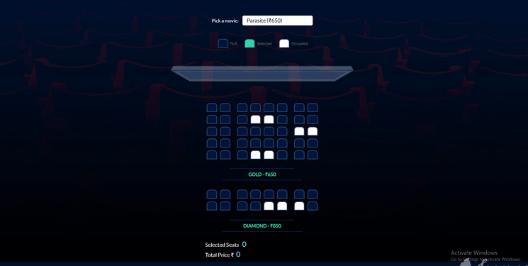

# Movie Seat Booking

[Link to Project](https://reverent-bose-df2ec0.netlify.com/)

#### UI displays movie selections and seats in a theater to choose from
### How it works -
* UI dispays the  movie list , screen, seats and seat info.
* User can select a movie and its price
* User can select and deselect seats
* User can not select occupied seats
#### Number of seats and price will update as soon as user selects any movie
## Local Storage is being used to save Seat , Movie and Price.So UI gets populated on refresh 

## Demo

	

